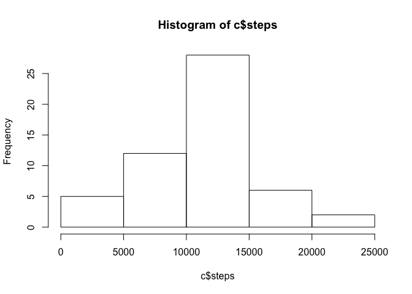
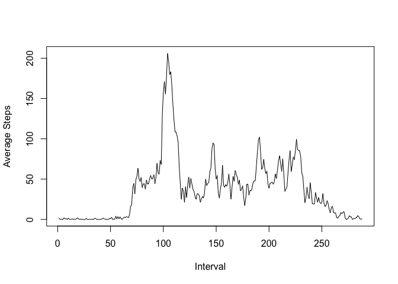

# Reproducible Research: Peer Assessment 1


## Loading and preprocessing the data

First we load up the activity data and view a summary.


```r
library(plyr)
```

```
## Warning: package 'plyr' was built under R version 3.1.3
```

```r
a <- data.frame(read.csv("activity.csv"))
summary(a)
```

```
##      steps                date          interval     
##  Min.   :  0.00   2012-10-01:  288   Min.   :   0.0  
##  1st Qu.:  0.00   2012-10-02:  288   1st Qu.: 588.8  
##  Median :  0.00   2012-10-03:  288   Median :1177.5  
##  Mean   : 37.38   2012-10-04:  288   Mean   :1177.5  
##  3rd Qu.: 12.00   2012-10-05:  288   3rd Qu.:1766.2  
##  Max.   :806.00   2012-10-06:  288   Max.   :2355.0  
##  NA's   :2304     (Other)   :15840
```

Next we remove the NAs from the steps data.


```r
b <- a[!is.na(a$steps),]
summary(b)
```

```
##      steps                date          interval     
##  Min.   :  0.00   2012-10-02:  288   Min.   :   0.0  
##  1st Qu.:  0.00   2012-10-03:  288   1st Qu.: 588.8  
##  Median :  0.00   2012-10-04:  288   Median :1177.5  
##  Mean   : 37.38   2012-10-05:  288   Mean   :1177.5  
##  3rd Qu.: 12.00   2012-10-06:  288   3rd Qu.:1766.2  
##  Max.   :806.00   2012-10-07:  288   Max.   :2355.0  
##                   (Other)   :13536
```


## What is mean total number of steps taken per day?

The total daily steps are then calculated and a histogram is plotted.


```r
c <- aggregate(steps ~ date , data=b , sum)
hist(c$steps)
```

 

The mean and median number of steps per day are:


```r
mean(c$steps)
```

```
## [1] 10766.19
```

```r
median(c$steps)
```

```
## [1] 10765
```

## What is the average daily activity pattern?

We then calculate another set giving the means accross the different intervals on all the days and plot a time series to show average steps across a day.


```r
d <- aggregate(steps ~ interval , data=b , mean)
plot(c(1:288), d$steps,type="l", xlab="Interval", ylab="Average Steps" )
```

 

The peak shown on the plot corresponds to the interval


```r
d[d$steps==max(d$steps),]$interval
```

```
## [1] 835
```

Therefore the 5-minute interval 8:35 until 8:40.

## Imputing missing values


## Are there differences in activity patterns between weekdays and weekends?
