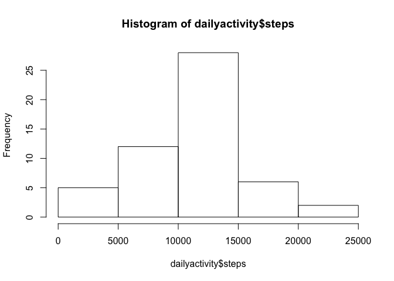
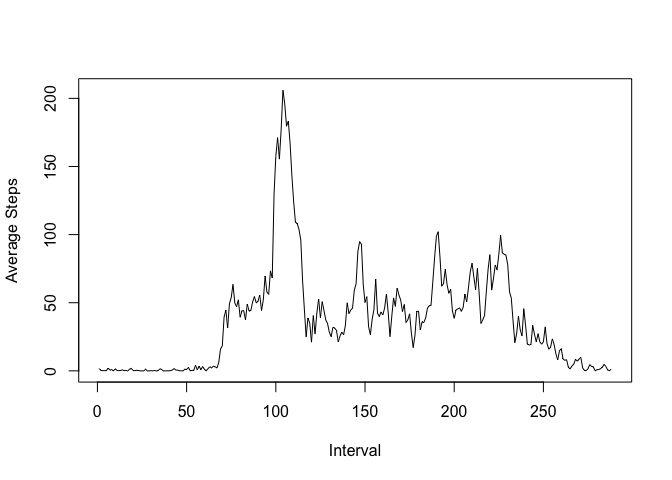
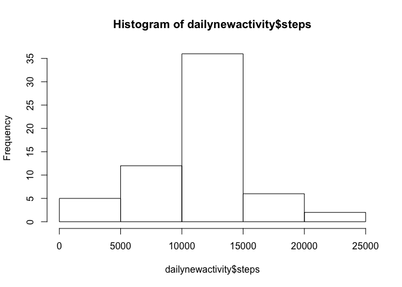
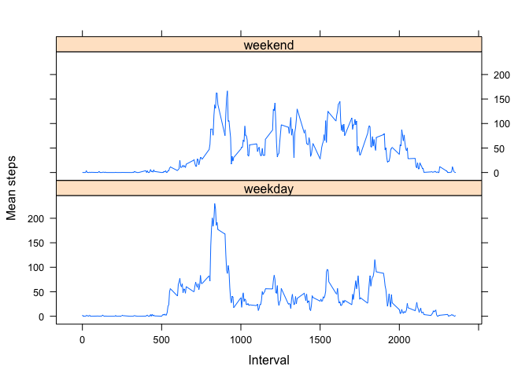

# Reproducible Research: Peer Assessment 1
Christos Savva, CEO [Velistar Consulting & Solutions](http://www.velistar.com)  
2015-06-08  


## Loading and preprocessing the data

First we load up the activity data and view a summary.


```r
library(plyr)
```

```
## Warning: package 'plyr' was built under R version 3.1.3
```

```r
library(lattice)
activity <- read.csv("activity.csv", stringsAsFactors=FALSE)
summary(activity)
```

```
##      steps            date              interval     
##  Min.   :  0.00   Length:17568       Min.   :   0.0  
##  1st Qu.:  0.00   Class :character   1st Qu.: 588.8  
##  Median :  0.00   Mode  :character   Median :1177.5  
##  Mean   : 37.38                      Mean   :1177.5  
##  3rd Qu.: 12.00                      3rd Qu.:1766.2  
##  Max.   :806.00                      Max.   :2355.0  
##  NA's   :2304
```

We convert the date variable from character strings to dates for later use.


```r
activity$date <- as.Date(activity$date)
```

Next we remove the NAs from the steps data.


```r
activityNAremoved <- activity[!is.na(activity$steps),]
summary(activityNAremoved)
```

```
##      steps             date               interval     
##  Min.   :  0.00   Min.   :2012-10-02   Min.   :   0.0  
##  1st Qu.:  0.00   1st Qu.:2012-10-16   1st Qu.: 588.8  
##  Median :  0.00   Median :2012-10-29   Median :1177.5  
##  Mean   : 37.38   Mean   :2012-10-30   Mean   :1177.5  
##  3rd Qu.: 12.00   3rd Qu.:2012-11-16   3rd Qu.:1766.2  
##  Max.   :806.00   Max.   :2012-11-29   Max.   :2355.0
```


## What is mean total number of steps taken per day?

The total daily steps are then calculated and a histogram is plotted.


```r
dailyactivity <- aggregate(steps ~ date , data = activityNAremoved , sum)
hist(dailyactivity$steps)
```

 

The mean and median number of steps per day are:


```r
mean(dailyactivity$steps)
```

```
## [1] 10766.19
```

```r
median(dailyactivity$steps)
```

```
## [1] 10765
```

## What is the average daily activity pattern?

We then calculate another set giving the means accross the different intervals on all the days and plot a time series to show average steps across a day.


```r
intervalactivity <- aggregate(steps ~ interval , data = activityNAremoved , mean)
plot(c(1:288), intervalactivity$steps,type="l", xlab="Interval", ylab="Average Steps" )
```

 

The peak shown on the plot corresponds to the interval


```r
intervalactivity[intervalactivity$steps==max(intervalactivity$steps),]$interval
```

```
## [1] 835
```

Therefore the 5-minute interval 8:35 until 8:40.

## Imputing missing values

The total number of missing values (NAs) in the original dataset is


```r
NAactivity <- activity[is.na(activity),]
length(NAactivity[,1])
```

```
## [1] 2304
```

The NA values would be replaced by the mean of each of the intervals that relate to the interval of the missing value, i.e. if a value is missing in the interval 95 then it is replaced by the mean value across the interval 95 as calculated above. You can tell from the summary output that there are no more NA values.


```r
newactivity <- activity
y <- sapply(unique(activity$interval), function (x) newactivity[!complete.cases(newactivity) & (newactivity$interval == x),1] <<- intervalactivity$steps[intervalactivity$interval == x])
summary(newactivity)
```

```
##      steps             date               interval     
##  Min.   :  0.00   Min.   :2012-10-01   Min.   :   0.0  
##  1st Qu.:  0.00   1st Qu.:2012-10-16   1st Qu.: 588.8  
##  Median :  0.00   Median :2012-10-31   Median :1177.5  
##  Mean   : 37.38   Mean   :2012-10-31   Mean   :1177.5  
##  3rd Qu.: 27.00   3rd Qu.:2012-11-15   3rd Qu.:1766.2  
##  Max.   :806.00   Max.   :2012-11-30   Max.   :2355.0
```

The total daily steps are then calculated for the new activity data and a histogram is plotted.


```r
dailynewactivity <- aggregate(steps ~ date , data = newactivity , sum)
hist(dailynewactivity$steps)
```

 

The mean and median number of steps per day for the new activity data are:


```r
mean(dailynewactivity$steps)
```

```
## [1] 10766.19
```

```r
median(dailynewactivity$steps)
```

```
## [1] 10766.19
```

The differences to the previous are:


```r
mean(dailynewactivity$steps) - mean(dailyactivity$steps)
```

```
## [1] 0
```

```r
median(dailynewactivity$steps) - median(dailyactivity$steps)
```

```
## [1] 1.188679
```

Therefore after imputting the mean interval values instead of the missing values, the new mean of total steps taken per day is the same as that of the old mean but the new median of total steps taken per day is greater than that of the median in the original data series.

This behaviour is expected since we are using mean values therefore not affecting the mean but we introduced more values therefore affecting the position of the median.

## Are there differences in activity patterns between weekdays and weekends?

Then we create a new factor variable which denotes whether the day is a weekday or a weekend. We use an intermediary variable to identity the name of the day.


```r
newactivity$weekday <- weekdays(newactivity$date)
newactivity$weekdayfactor <- as.factor(c("weekend", "weekday"))
newactivity[newactivity$weekday == "Sunday" | newactivity$weekday == "Saturday" ,5]<- factor("weekend")
newactivity[!(newactivity$weekday == "Sunday" | newactivity$weekday == "Saturday" ) ,5]<- factor("weekday")
```

Using this new dataset we plot the average activity accross the intervals in a day to show the difference between weekday and weekend steps activity.


```r
intervalmeannewactivity <- ddply (newactivity,
              .(interval, weekdayfactor), 
              summarize, 
              stepMean = mean(steps, na.rm=TRUE))
xyplot (stepMean ~ interval | weekdayfactor, 
        data=intervalmeannewactivity,
        type='l',
        layout=c (1, 2),
        xlab='Interval',
        ylab='Mean steps')
```

 

The results are as expected with the weekday showing a large spike in the morning indicating the subject is commuting to work compared to no such spike in the weekends.
